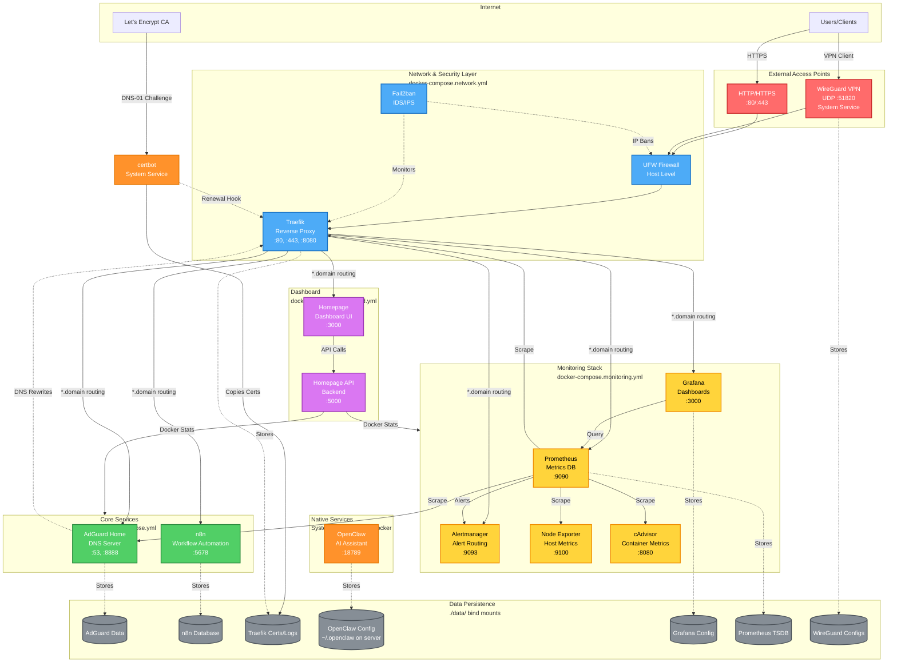
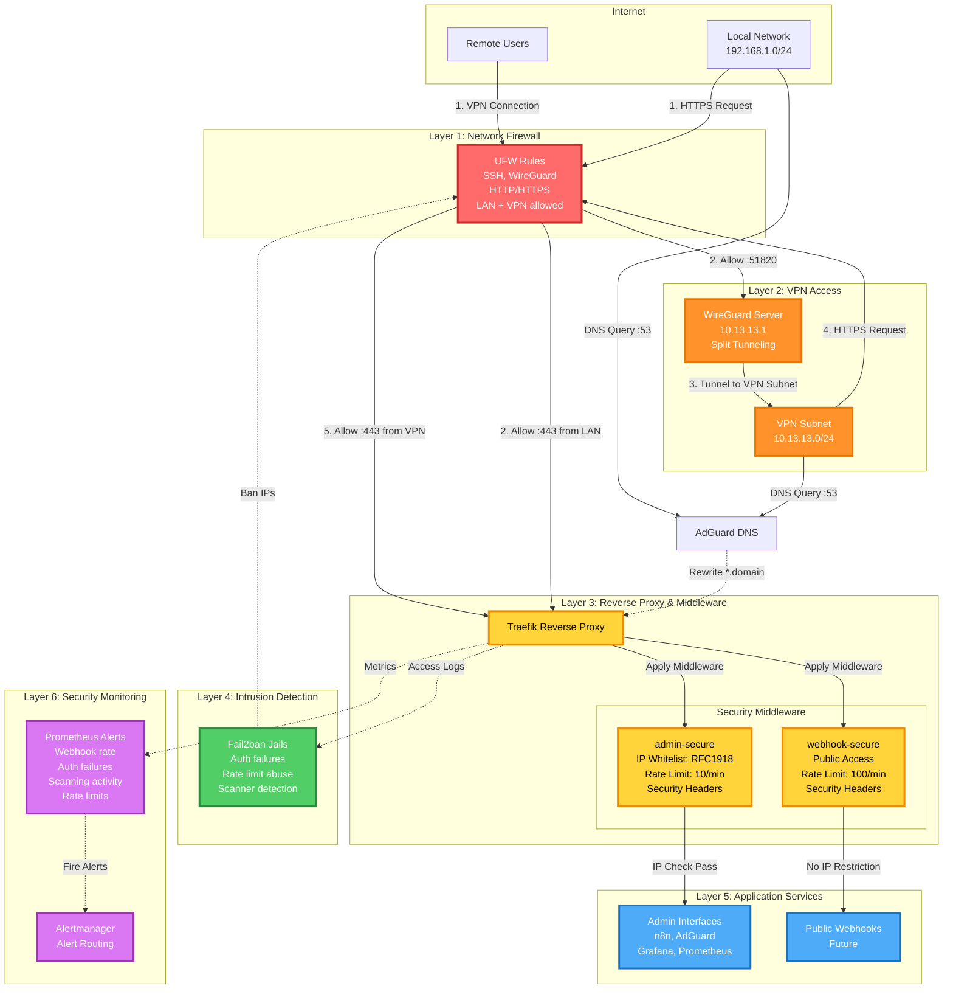
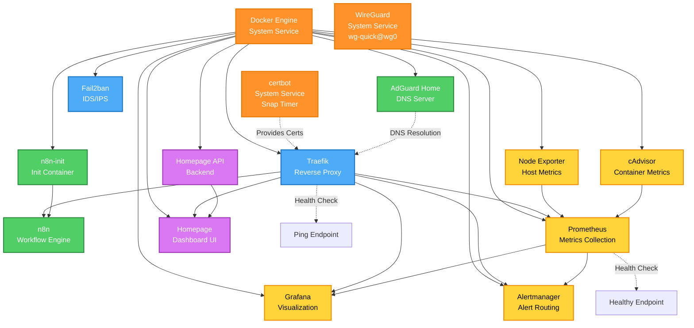
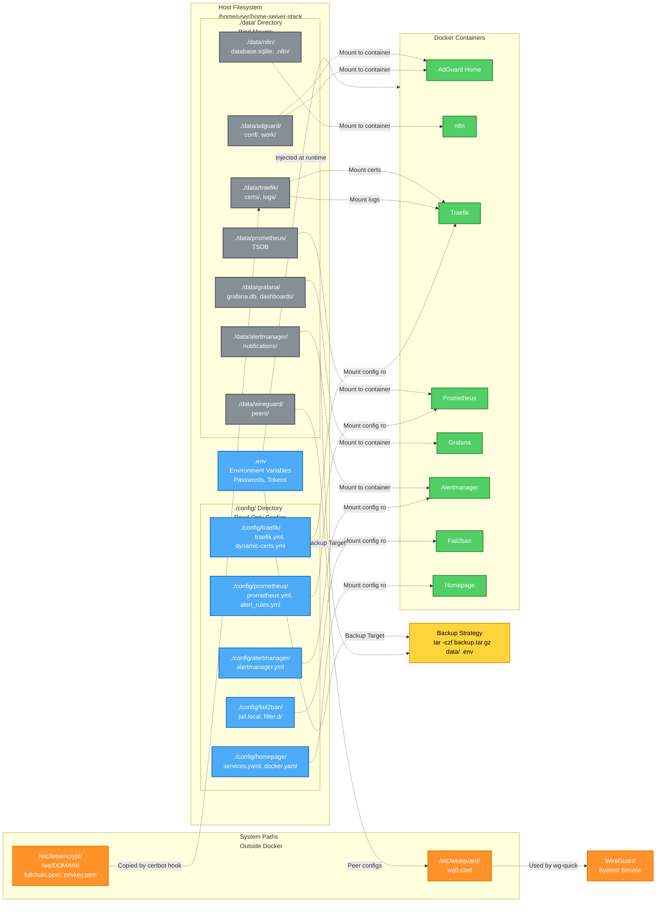
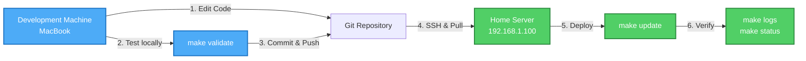

# Infrastructure Architecture

This document provides visual diagrams of the home server stack architecture, showing service organization, network flows, and data persistence.

## Table of Contents
- [High-Level Architecture](#high-level-architecture)
- [Network Flow & Security Layers](#network-flow--security-layers)
- [Service Dependencies](#service-dependencies)
- [Data Persistence](#data-persistence)

---

## High-Level Architecture

This diagram shows all services organized by their Docker Compose files and system services.



---

## Network Flow & Security Layers

This diagram focuses on the defense-in-depth security architecture and request flow.



---

## Service Dependencies

This diagram shows the startup dependencies and service relationships.



---

## Data Persistence

This diagram shows how data is persisted across container restarts.



---

## Key Architecture Patterns

### Multi-File Compose Organization
The stack uses four compose files for logical separation:
- **docker-compose.yml**: Core services (AdGuard, n8n)
- **docker-compose.network.yml**: Network & Security (Traefik, Fail2ban)
- **docker-compose.monitoring.yml**: Monitoring stack (Prometheus, Grafana, Alertmanager, exporters)
- **docker-compose.dashboard.yml**: Dashboard (Homepage, Homepage API)

### Domain-Based Routing
All services accessible via `https://<service>.${DOMAIN}`:
1. **AdGuard Home** (DNS :53) resolves `*.DOMAIN` → `SERVER_IP`
2. **Traefik** (reverse proxy :80/:443) routes based on Host header
3. Services discovered via Docker labels: `traefik.http.routers.<service>.rule=Host(\`<service>.${DOMAIN}\`)`

### Defense-in-Depth Security
Six security layers protect the stack:
1. **Network Firewall (UFW)**: Default deny, rate-limited SSH, WireGuard + HTTP/HTTPS only
2. **VPN Access (WireGuard)**: Primary remote access, split tunneling to home network only
3. **Reverse Proxy Middleware (Traefik)**: IP whitelisting, rate limiting, security headers
4. **Intrusion Detection (Fail2ban)**: Monitors auth failures, scanning, rate limit abuse
5. **Application Services**: Admin interfaces require VPN/LAN, future webhooks separated
6. **Security Monitoring (Prometheus)**: Alerts on suspicious patterns

### SSL Certificate Management
Uses **certbot with Gandi DNS plugin** for Let's Encrypt wildcard certificates:
- certbot generates `*.DOMAIN` cert via DNS-01 challenge
- Certificates copied from `/etc/letsencrypt/` to `./data/traefik/certs/`
- Traefik loads via file provider (`./config/traefik/dynamic-certs.yml`)
- Auto-renewal via certbot snap timer + post-renewal hook
- Hook copies renewed certs and restarts Traefik container

### System-Level Services
**WireGuard VPN** runs as system service (not Docker) to ensure VPN access remains available when Docker services restart. certbot also runs as system service via snap timer for reliable certificate renewal.

### Data Persistence Strategy
All persistent data uses **bind mounts** (not Docker volumes) in `./data/` for easy backups:
```bash
tar -czf backup.tar.gz data/ .env
```

---

## Network Ports

### External Access
- **22** - SSH (rate-limited via UFW)
- **51820** - WireGuard VPN (UDP)
- **80** - HTTP (redirects to HTTPS)
- **443** - HTTPS (Traefik reverse proxy)

### Internal Services (via Traefik domain routing)
- **n8n** - https://n8n.${DOMAIN}
- **AdGuard** - https://adguard.${DOMAIN} (also http://${SERVER_IP}:8888)
- **Grafana** - https://grafana.${DOMAIN}
- **Prometheus** - https://prometheus.${DOMAIN}
- **Alertmanager** - https://alerts.${DOMAIN}
- **Homepage** - https://home.${DOMAIN}
- **Traefik Dashboard** - https://traefik.${DOMAIN}

### Direct Access (monitoring, not exposed externally)
- **9090** - Prometheus (metrics)
- **9093** - Alertmanager (alerts)
- **9100** - Node Exporter (host metrics)
- **9323** - Docker daemon metrics
- **8080** - cAdvisor (container metrics)

---

## Deployment Workflow



**Important**: This stack runs on a dedicated home server, not the development machine. Local `docker compose up` will not replicate the production environment without proper DNS setup. Always deploy and troubleshoot on the actual server via SSH.

