# Infrastructure Architecture

This document provides visual diagrams of the home server stack architecture, showing service organization, network flows, and data persistence.

## Table of Contents
- [High-Level Architecture](#high-level-architecture)
- [Network Flow & Security Layers](#network-flow--security-layers)
- [Service Dependencies](#service-dependencies)
- [Data Persistence](#data-persistence)

---

## High-Level Architecture

This diagram shows all services organized by their Docker Compose files and system services.

```mermaid
graph TB
    subgraph Internet["🌐 Internet"]
        Users[Users/Clients]
        LetsEncrypt[Let's Encrypt CA]
    end

    subgraph External["External Access Points"]
        VPN[WireGuard VPN<br/>UDP :51820<br/>System Service]
        HTTP[HTTP/HTTPS<br/>:80/:443]
    end

    subgraph Network["Network & Security Layer<br/>(docker-compose.network.yml)"]
        Traefik[Traefik<br/>Reverse Proxy<br/>:80, :443, :8080]
        Fail2ban[Fail2ban<br/>IDS/IPS]
        UFW[UFW Firewall<br/>Host Level]
    end

    subgraph Core["Core Services<br/>(docker-compose.yml)"]
        AdGuard[AdGuard Home<br/>DNS Server<br/>:53, :8888]
        N8N[n8n<br/>Workflow Automation<br/>:5678]
    end

    subgraph Monitoring["Monitoring Stack<br/>(docker-compose.monitoring.yml)"]
        Prometheus[Prometheus<br/>Metrics DB<br/>:9090]
        Grafana[Grafana<br/>Dashboards<br/>:3000]
        Alertmanager[Alertmanager<br/>Alert Routing<br/>:9093]
        NodeExporter[Node Exporter<br/>Host Metrics<br/>:9100]
        CAdvisor[cAdvisor<br/>Container Metrics<br/>:8080]
    end

    subgraph Dashboard["Dashboard<br/>(docker-compose.dashboard.yml)"]
        Homepage[Homepage<br/>Dashboard UI<br/>:3000]
        HomepageAPI[Homepage API<br/>Backend<br/>:3001]
    end

    subgraph Data["Data Persistence<br/>(./data/ bind mounts)"]
        AdGuardData[(AdGuard Data)]
        N8NData[(n8n Database)]
        TraefikData[(Traefik Certs/Logs)]
        GrafanaData[(Grafana Config)]
        PrometheusData[(Prometheus TSDB)]
        WireGuardData[(WireGuard Configs)]
    end

    %% External connections
    Users -->|HTTPS| HTTP
    Users -->|VPN Client| VPN
    LetsEncrypt -->|DNS-01 Challenge| Certbot[certbot<br/>System Service]

    %% Network layer
    HTTP --> UFW
    VPN --> UFW
    UFW --> Traefik
    Fail2ban -.->|Monitors| Traefik
    Fail2ban -.->|IP Bans| UFW

    %% Traefik routing
    Traefik -->|*.domain routing| AdGuard
    Traefik -->|*.domain routing| N8N
    Traefik -->|*.domain routing| Grafana
    Traefik -->|*.domain routing| Prometheus
    Traefik -->|*.domain routing| Alertmanager
    Traefik -->|*.domain routing| Homepage

    %% DNS resolution
    AdGuard -.->|DNS Rewrites<br/>*.domain → SERVER_IP| Traefik

    %% Monitoring flows
    Prometheus -->|Scrape| NodeExporter
    Prometheus -->|Scrape| CAdvisor
    Prometheus -->|Scrape| Traefik
    Prometheus -->|Scrape| AdGuard
    Grafana -->|Query| Prometheus
    Prometheus -->|Alerts| Alertmanager

    %% Dashboard flows
    Homepage -->|API Calls| HomepageAPI
    HomepageAPI -->|Docker Stats| Core
    HomepageAPI -->|Docker Stats| Monitoring

    %% Certificate management
    Certbot -->|Copies Certs| TraefikData
    Certbot -.->|Renewal Hook<br/>Restart| Traefik

    %% Data persistence
    AdGuard -.->|Stores| AdGuardData
    N8N -.->|Stores| N8NData
    Traefik -.->|Stores| TraefikData
    Grafana -.->|Stores| GrafanaData
    Prometheus -.->|Stores| PrometheusData
    VPN -.->|Stores| WireGuardData

    classDef external fill:#ff6b6b,stroke:#c92a2a,stroke-width:2px,color:#fff
    classDef network fill:#4dabf7,stroke:#1971c2,stroke-width:2px,color:#fff
    classDef core fill:#51cf66,stroke:#2b8a3e,stroke-width:2px,color:#fff
    classDef monitoring fill:#ffd43b,stroke:#f08c00,stroke-width:2px,color:#000
    classDef dashboard fill:#da77f2,stroke:#9c36b5,stroke-width:2px,color:#fff
    classDef data fill:#868e96,stroke:#495057,stroke-width:2px,color:#fff
    classDef system fill:#ff922b,stroke:#e67700,stroke-width:2px,color:#fff

    class VPN,HTTP external
    class Traefik,Fail2ban,UFW network
    class AdGuard,N8N core
    class Prometheus,Grafana,Alertmanager,NodeExporter,CAdvisor monitoring
    class Homepage,HomepageAPI dashboard
    class AdGuardData,N8NData,TraefikData,GrafanaData,PrometheusData,WireGuardData data
    class Certbot system
```



---

## Network Flow & Security Layers

This diagram focuses on the defense-in-depth security architecture and request flow.

```mermaid
graph TB
    subgraph Internet["🌐 Internet"]
        Remote[Remote Users]
        Local[Local Network<br/>192.168.1.0/24]
    end

    subgraph L1["Layer 1: Network Firewall (UFW)"]
        UFW[UFW Rules<br/>• SSH :22 (rate-limited)<br/>• WireGuard :51820<br/>• HTTP/HTTPS :80/:443<br/>• Allow 192.168.1.0/24<br/>• Allow 10.13.13.0/24]
    end

    subgraph L2["Layer 2: VPN Access"]
        WG[WireGuard Server<br/>10.13.13.1<br/>Split Tunneling]
        VPNSubnet[VPN Subnet<br/>10.13.13.0/24]
    end

    subgraph L3["Layer 3: Reverse Proxy & Middleware"]
        Traefik[Traefik Reverse Proxy]

        subgraph Middleware["Security Middleware"]
            AdminSecure["admin-secure<br/>• IP Whitelist: RFC1918<br/>• Rate Limit: 10/min<br/>• Security Headers"]
            WebhookSecure["webhook-secure<br/>• Public Access<br/>• Rate Limit: 100/min<br/>• Security Headers"]
        end
    end

    subgraph L4["Layer 4: Intrusion Detection"]
        Fail2ban["Fail2ban Jails<br/>• traefik-auth (401)<br/>• traefik-webhook (429)<br/>• traefik-scanner (404)"]
    end

    subgraph L5["Layer 5: Application Services"]
        direction LR
        Admin["Admin Interfaces<br/>n8n, AdGuard,<br/>Grafana, Prometheus"]
        Webhooks["Public Webhooks<br/>(Future)"]
    end

    subgraph L6["Layer 6: Security Monitoring"]
        PromAlerts["Prometheus Alerts<br/>• High webhook rate<br/>• Auth failures<br/>• Scanning activity<br/>• Rate limit hits"]
        Alertmanager["Alertmanager<br/>Alert Routing"]
    end

    %% Request flow - Remote via VPN
    Remote -->|1. VPN Connection| UFW
    UFW -->|2. Allow :51820| WG
    WG -->|3. Tunnel to VPN Subnet| VPNSubnet
    VPNSubnet -->|4. HTTPS Request| UFW
    UFW -->|5. Allow :443 from VPN| Traefik

    %% Request flow - Local network
    Local -->|1. HTTPS Request| UFW
    UFW -->|2. Allow :443 from LAN| Traefik

    %% Traefik routing
    Traefik -->|Apply Middleware| AdminSecure
    Traefik -->|Apply Middleware| WebhookSecure
    AdminSecure -->|IP Check Pass| Admin
    WebhookSecure -->|No IP Restriction| Webhooks

    %% Security monitoring
    Traefik -.->|Access Logs| Fail2ban
    Fail2ban -.->|Ban IPs| UFW
    Traefik -.->|Metrics| PromAlerts
    PromAlerts -.->|Fire Alerts| Alertmanager

    %% DNS flow
    Local -->|DNS Query :53| DNS[AdGuard DNS]
    VPNSubnet -->|DNS Query :53| DNS
    DNS -.->|Rewrite *.domain| Traefik

    classDef layer1 fill:#ff6b6b,stroke:#c92a2a,stroke-width:3px,color:#fff
    classDef layer2 fill:#ff922b,stroke:#e67700,stroke-width:3px,color:#fff
    classDef layer3 fill:#ffd43b,stroke:#f08c00,stroke-width:3px,color:#000
    classDef layer4 fill:#51cf66,stroke:#2b8a3e,stroke-width:3px,color:#fff
    classDef layer5 fill:#4dabf7,stroke:#1971c2,stroke-width:3px,color:#fff
    classDef layer6 fill:#da77f2,stroke:#9c36b5,stroke-width:3px,color:#fff

    class UFW layer1
    class WG,VPNSubnet layer2
    class Traefik,AdminSecure,WebhookSecure layer3
    class Fail2ban layer4
    class Admin,Webhooks layer5
    class PromAlerts,Alertmanager layer6
```

---

## Service Dependencies

This diagram shows the startup dependencies and service relationships.

```mermaid
graph TD
    %% System services
    Docker[Docker Engine<br/>System Service]
    WireGuard[WireGuard<br/>System Service<br/>wg-quick@wg0]
    Certbot[certbot<br/>System Service<br/>Snap Timer]

    %% Network layer - must start first
    Traefik[Traefik<br/>Reverse Proxy]
    Fail2ban[Fail2ban<br/>IDS/IPS]

    %% Core services - depend on network
    AdGuard[AdGuard Home<br/>DNS Server]
    N8NInit[n8n-init<br/>Init Container]
    N8N[n8n<br/>Workflow Engine]

    %% Monitoring - depends on core services
    Prometheus[Prometheus<br/>Metrics Collection]
    NodeExporter[Node Exporter<br/>Host Metrics]
    CAdvisor[cAdvisor<br/>Container Metrics]
    Grafana[Grafana<br/>Visualization]
    Alertmanager[Alertmanager<br/>Alert Routing]

    %% Dashboard - depends on monitoring
    HomepageAPI[Homepage API<br/>Backend]
    Homepage[Homepage<br/>Dashboard UI]

    %% Dependencies
    Docker --> Traefik
    Docker --> Fail2ban
    Docker --> AdGuard
    Docker --> N8NInit
    Docker --> NodeExporter
    Docker --> CAdvisor
    Docker --> Prometheus
    Docker --> Grafana
    Docker --> Alertmanager
    Docker --> HomepageAPI
    Docker --> Homepage

    Traefik --> N8N
    Traefik --> Grafana
    Traefik --> Prometheus
    Traefik --> Alertmanager
    Traefik --> Homepage

    N8NInit --> N8N

    NodeExporter --> Prometheus
    CAdvisor --> Prometheus
    Prometheus --> Grafana
    Prometheus --> Alertmanager

    HomepageAPI --> Homepage

    Certbot -.->|Provides Certs| Traefik
    AdGuard -.->|DNS Resolution| Traefik

    %% Health checks
    Traefik -.->|Health Check| TraefikPing[Ping Endpoint]
    Prometheus -.->|Health Check| PromHealth[/-/healthy]

    classDef system fill:#ff922b,stroke:#e67700,stroke-width:2px,color:#fff
    classDef network fill:#4dabf7,stroke:#1971c2,stroke-width:2px,color:#fff
    classDef core fill:#51cf66,stroke:#2b8a3e,stroke-width:2px,color:#fff
    classDef monitoring fill:#ffd43b,stroke:#f08c00,stroke-width:2px,color:#000
    classDef dashboard fill:#da77f2,stroke:#9c36b5,stroke-width:2px,color:#fff

    class Docker,WireGuard,Certbot system
    class Traefik,Fail2ban network
    class AdGuard,N8NInit,N8N core
    class Prometheus,NodeExporter,CAdvisor,Grafana,Alertmanager monitoring
    class HomepageAPI,Homepage dashboard
```

---

## Data Persistence

This diagram shows how data is persisted across container restarts.

```mermaid
graph LR
    subgraph Host["Host Filesystem<br/>/home/user/home-server-stack"]
        direction TB

        subgraph DataDir["./data/ Directory<br/>(Bind Mounts)"]
            direction TB
            AdGuardDir[./data/adguard/<br/>• conf/<br/>• work/]
            N8NDir[./data/n8n/<br/>• database.sqlite<br/>• .n8n/]
            TraefikDir[./data/traefik/<br/>• certs/<br/>• logs/]
            PrometheusDir[./data/prometheus/<br/>• TSDB]
            GrafanaDir[./data/grafana/<br/>• grafana.db<br/>• dashboards/]
            AlertmanagerDir[./data/alertmanager/<br/>• notifications/]
            WireGuardDir[./data/wireguard/<br/>• peers/]
        end

        subgraph ConfigDir["./config/ Directory<br/>(Read-Only Configs)"]
            direction TB
            TraefikConfig[./config/traefik/<br/>• traefik.yml<br/>• dynamic-certs.yml]
            Fail2banConfig[./config/fail2ban/<br/>• jail.local<br/>• filter.d/]
            PromConfig[./config/prometheus/<br/>• prometheus.yml<br/>• alert_rules.yml]
            AlertConfig[./config/alertmanager/<br/>• alertmanager.yml]
            HomepageConfig[./config/homepage/<br/>• services.yaml<br/>• docker.yaml]
        end

        EnvFile[.env<br/>Environment Variables<br/>Passwords, Tokens]
    end

    subgraph SystemPaths["System Paths<br/>(Outside Docker)"]
        LetsEncrypt[/etc/letsencrypt/<br/>live/DOMAIN/<br/>• fullchain.pem<br/>• privkey.pem]
        WGSystem[/etc/wireguard/<br/>• wg0.conf]
    end

    subgraph Containers["Docker Containers"]
        direction TB
        AdGuard[AdGuard Home]
        N8N[n8n]
        Traefik[Traefik]
        Prometheus[Prometheus]
        Grafana[Grafana]
        Alertmanager[Alertmanager]
        Fail2ban[Fail2ban]
        Homepage[Homepage]
    end

    %% Data mounts
    AdGuardDir -.->|Mount /opt/adguardhome/conf| AdGuard
    AdGuardDir -.->|Mount /opt/adguardhome/work| AdGuard
    N8NDir -.->|Mount /home/node/.n8n| N8N
    TraefikDir -.->|Mount /certs| Traefik
    TraefikDir -.->|Mount /logs| Traefik
    PrometheusDir -.->|Mount /prometheus| Prometheus
    GrafanaDir -.->|Mount /var/lib/grafana| Grafana
    AlertmanagerDir -.->|Mount /alertmanager| Alertmanager

    %% Config mounts (read-only)
    TraefikConfig -.->|Mount /etc/traefik (ro)| Traefik
    Fail2banConfig -.->|Mount /config (ro)| Fail2ban
    PromConfig -.->|Mount /etc/prometheus (ro)| Prometheus
    AlertConfig -.->|Mount /etc/alertmanager (ro)| Alertmanager
    HomepageConfig -.->|Mount /app/config (ro)| Homepage

    %% Environment variables
    EnvFile -.->|Injected at runtime| Containers

    %% System paths
    LetsEncrypt -.->|Copied by certbot hook| TraefikDir
    WGSystem -.->|Used by wg-quick| WireGuard[WireGuard<br/>System Service]
    WireGuardDir -.->|Peer configs| WGSystem

    %% Backup scope
    DataDir -.->|Backup Target| Backup[Backup Strategy<br/>tar -czf backup.tar.gz data/ .env]
    EnvFile -.->|Backup Target| Backup

    classDef data fill:#868e96,stroke:#495057,stroke-width:2px,color:#fff
    classDef config fill:#4dabf7,stroke:#1971c2,stroke-width:2px,color:#fff
    classDef container fill:#51cf66,stroke:#2b8a3e,stroke-width:2px,color:#fff
    classDef system fill:#ff922b,stroke:#e67700,stroke-width:2px,color:#fff
    classDef backup fill:#ffd43b,stroke:#f08c00,stroke-width:2px,color:#000

    class AdGuardDir,N8NDir,TraefikDir,PrometheusDir,GrafanaDir,AlertmanagerDir,WireGuardDir data
    class TraefikConfig,Fail2banConfig,PromConfig,AlertConfig,HomepageConfig,EnvFile config
    class AdGuard,N8N,Traefik,Prometheus,Grafana,Alertmanager,Fail2ban,Homepage container
    class LetsEncrypt,WGSystem,WireGuard system
    class Backup backup
```

---

## Key Architecture Patterns

### Multi-File Compose Organization
The stack uses four compose files for logical separation:
- **docker-compose.yml**: Core services (AdGuard, n8n)
- **docker-compose.network.yml**: Network & Security (Traefik, Fail2ban)
- **docker-compose.monitoring.yml**: Monitoring stack (Prometheus, Grafana, Alertmanager, exporters)
- **docker-compose.dashboard.yml**: Dashboard (Homepage, Homepage API)

### Domain-Based Routing
All services accessible via `https://<service>.${DOMAIN}`:
1. **AdGuard Home** (DNS :53) resolves `*.DOMAIN` → `SERVER_IP`
2. **Traefik** (reverse proxy :80/:443) routes based on Host header
3. Services discovered via Docker labels: `traefik.http.routers.<service>.rule=Host(\`<service>.${DOMAIN}\`)`

### Defense-in-Depth Security
Six security layers protect the stack:
1. **Network Firewall (UFW)**: Default deny, rate-limited SSH, WireGuard + HTTP/HTTPS only
2. **VPN Access (WireGuard)**: Primary remote access, split tunneling to home network only
3. **Reverse Proxy Middleware (Traefik)**: IP whitelisting, rate limiting, security headers
4. **Intrusion Detection (Fail2ban)**: Monitors auth failures, scanning, rate limit abuse
5. **Application Services**: Admin interfaces require VPN/LAN, future webhooks separated
6. **Security Monitoring (Prometheus)**: Alerts on suspicious patterns

### SSL Certificate Management
Uses **certbot with Gandi DNS plugin** for Let's Encrypt wildcard certificates:
- certbot generates `*.DOMAIN` cert via DNS-01 challenge
- Certificates copied from `/etc/letsencrypt/` to `./data/traefik/certs/`
- Traefik loads via file provider (`./config/traefik/dynamic-certs.yml`)
- Auto-renewal via certbot snap timer + post-renewal hook
- Hook copies renewed certs and restarts Traefik container

### System-Level Services
**WireGuard VPN** runs as system service (not Docker) to ensure VPN access remains available when Docker services restart. certbot also runs as system service via snap timer for reliable certificate renewal.

### Data Persistence Strategy
All persistent data uses **bind mounts** (not Docker volumes) in `./data/` for easy backups:
```bash
tar -czf backup.tar.gz data/ .env
```

---

## Network Ports

### External Access
- **22** - SSH (rate-limited via UFW)
- **51820** - WireGuard VPN (UDP)
- **80** - HTTP (redirects to HTTPS)
- **443** - HTTPS (Traefik reverse proxy)

### Internal Services (via Traefik domain routing)
- **n8n** - https://n8n.${DOMAIN}
- **AdGuard** - https://adguard.${DOMAIN} (also http://${SERVER_IP}:8888)
- **Grafana** - https://grafana.${DOMAIN}
- **Prometheus** - https://prometheus.${DOMAIN}
- **Alertmanager** - https://alerts.${DOMAIN}
- **Homepage** - https://home.${DOMAIN}
- **Traefik Dashboard** - https://traefik.${DOMAIN}

### Direct Access (monitoring, not exposed externally)
- **9090** - Prometheus (metrics)
- **9093** - Alertmanager (alerts)
- **9100** - Node Exporter (host metrics)
- **9323** - Docker daemon metrics
- **8080** - cAdvisor (container metrics)

---

## Deployment Workflow


**Important**: This stack runs on a dedicated home server, not the development machine. Local `docker compose up` will not replicate the production environment without proper DNS setup. Always deploy and troubleshoot on the actual server via SSH.

